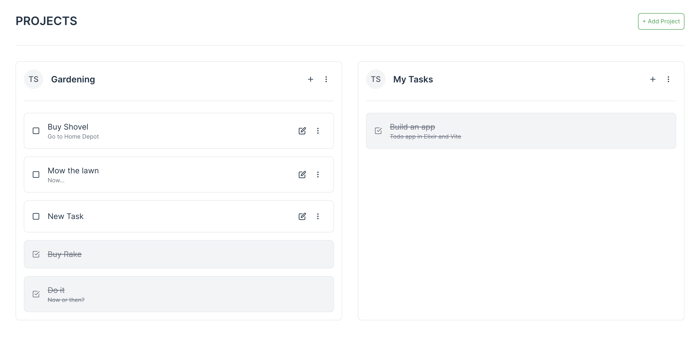

<div align="center">

# Elixir Todo App Tutorial

A beginner step-by-step guide to building a simple todo app utilizing Elixir Liveview

<br />


<br /><br />

</div>

# About the Project

Elixir is a really powerful tool that has been out for several years. Though Elixir has a great frontend framework in Phoenix and Liveview, some developers aren't familiar with building an app in this framework. This tutorial walks through how to work in a full stack Elixir application utilizing Phoenix Liveview.

<br />

<picture>
  <source media="(prefers-color-scheme: dark)" srcset="readme_images/todo_screenshot_dark.png">
  
</picture>

<br />

### Prerequisites

Before you get started, there are a few things you should have installed on your system. 

* Postgres
* Erlang
* Elixir
* Node package manager: `pnpm`, `npm`, or `yarn`

<br />

## Running the finished app locally

If you want to check out the finished Todo app locally make sure you have the prerequisites above and follow these steps:

Clone the repo
```bash
git clone git@github.com:cplumley/todo_ex.git && cd todo_ex
```

Create the database, install dependencies, and seed the initial user data
```bash
mix setup
```

Run the app
```
mix phx.server
```

You should now be able to visit the following urls to play with the application:

**Application**: http://localhost:4000
